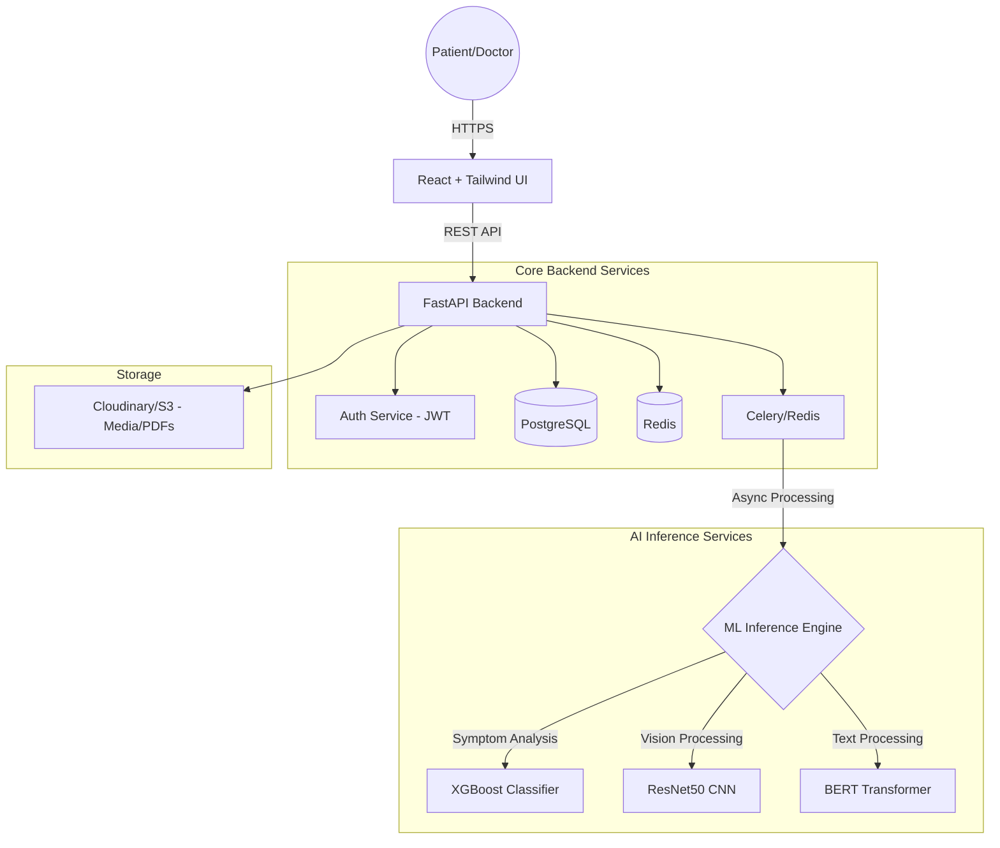

# Implementation Plan: AI Healthcare Diagnosis System (Premium Edition)

## 1. Project Overview
The **AI Healthcare Diagnosis System** is a sophisticated, multi-modal medical platform that leverages Artificial Intelligence to assist both patients and doctors. It combines Natural Language Processing (NLP) for symptom analysis, Computer Vision for medical imaging, and structured Machine Learning for risk assessment.

## 2. System Architecture
The system will follow a microservices-inspired monolithic architecture initially for ease of development, ensuring clear separation between the UI, API, and Machine Learning services.

### Component Details:
- **Frontend**: Single Page Application (SPA) built with React.js, using Tailwind CSS for a premium, responsive medical interface.
- **Backend**: FastAPI for high-performance asynchronous API endpoints.
- **Database**: PostgreSQL for relational data (users, patients, appointments, history). Redis for session caching and task queuing.
- **ML Engine**: A dedicated set of Python services using TensorFlow/Keras and Scikit-learn to serve models.

---

## 3. Feature Specification

### 3.1 Patient Features
- **Smart Symptom Checker**: A conversational interface where patients input symptoms;---

## 4. REST API Design (v1)
All endpoints will be prefixed with `/api/v1`.

### 4.1 Authentication & Profile
- `POST /auth/register`: User registration with role selection.
- `POST /auth/login`: JWT token generation.
- `GET /user/profile`: Retrieve patient/doctor medical profile.
- `PUT /user/profile`: Update medical allergies/history.

### 4.2 Diagnosis & AI
- **Symptom Analysis**: `POST /diagnosis/symptoms`
    - *Payload*: `{"symptoms": ["fever", "cough"], "duration": "3 days"}`
    - *Response*: Predicted disease + confidence + recommended specialist.
- **Image Processing**: `POST /diagnosis/upload-scan`
    - *Payload*: Multi-part form data (Image) + scan type (X-Ray/MRI).
    - *Response*: `task_id` (for async processing).
- **Inference Status**: `GET /diagnosis/status/{task_id}`
    - *Response*: Processing status or final result heatmap URL.

### 4.3 Consultations & Appointments
- `GET /appointments`: List upcoming slots.
- `POST /appointments/book`: Create a new booking linked to a specialism.
- `POST /consultations/{id}/report`: Generate AI-summarized PDF report.

---

## 5. Database Strategy & Rationale
We have evaluated **PostgreSQL (SQL)** vs **MongoDB (NoSQL)** for this project:

- **Chosen: PostgreSQL (SQL)**
    - **Relational Integrity**: Essential for linking Patients, Doctors, and Consultations.
    - **ACID Compliance**: Critical for medical data consistency.
    - **Academic Value**: SQL schema design and normalization are key components expected in an MCA Major Project.
    - **JSONB Support**: PostgreSQL allows us to store flexible symptom data (like a NoSQL DB) while maintaining relational power for everything else.

---

## 6. Detailed Database Schema
We will use SQLAlchemy (PostgreSQL) with the following key models:

### 5.1 `User` Table
- `id` (UUID, PK)
- `email` (String, Unique)
- `hashed_password` (String)
- `role` (Enum: PATIENT, DOCTOR, ADMIN)
- `is_active` (Boolean)

### 5.2 `PatientProfile` Table
- `user_id` (FK -> User.id)
- `date_of_birth` (Date)
- `blood_group` (String)
- `chronic_conditions` (JSONB)
- `emergency_contact` (String)

### 5.3 `MedicalRecord` Table
- `id` (UUID, PK)
- `patient_id` (FK -> User.id)
- `doctor_id` (FK -> User.id, Optional)
- `symptoms` (JSONB)
- `ai_prediction` (String)
- `confidence_score` (Float)
- `image_url` (String, Optional)
- `created_at` (Timestamp)

---

## 6. AI Model Training & Inference Strategy

### 6.1 Symptom Predictor (XGBoost)
- **Data**: Kaggle 4.9k Symptom-Disease dataset.
- **Pre-processing**: One-hot encoding for symptoms.
- **Optimization**: Hyperparameter tuning via GridSearchCV for multi-class accuracy (>92%).

### 6.2 Vision Analysis (CNN)
- **Base Model**: ResNet50 pre-trained on ImageNet.
- **Fine-tuning**: Frozen early layers, custom dense layers for chest pathologies (Pneumonia, Effusion).
- **Input**: 224x224 RGB images.

### 6.3 Specialist Recommendation (NLP)
- **Model**: Sentence-Transformers (BERT-based).
- **Process**: Match predicted disease to doctor specialisms (e.g., "Pneumonia" -> "Pulmonologist") using semantic similarity.

---

## 7. Premium UI/UX Strategy
h relevant specialists.

### 3.2 Doctor Features
- **Review Dashboard**: AI-assisted triage system highlighting critical cases (high risk).
- **Medical Report Tool**: Automated generation of comprehensive reports using BERT to summarize patient history and AI findings.
- **Digital Prescription Export**: Tool to create and export digital prescriptions as PDFs with professional medical branding.
- **History Tracker**: A dashboard showing past diagnoses, prescriptions, and recovery progress.
- **Image Upload**: Interface to upload X-Rays/MRI/Skin scans for AI review.
- **Appointment Booking**: Integrated calendar to book slots with relevant specialists.

### 3.3 Core AI Capabilities
- **Disease Prediction**: Multi-class classification based on structured symptom data.
- **Anomaly Detection (Vision)**: Binary and multi-class classification for lung pathologies (X-Ray) or skin lesions.
- **Risk Assessment**: Predictive modeling to calculate patient mortality or complication risk.

---

## 4. Implementation Roadmap

### Phase 1: Foundation (Weeks 1-2)
- [ ] Set up project structure (Monorepo with `/frontend`, `/backend`, `/ml-models`).
- [ ] Implement User Authentication (JWT-based).
- [ ] Database schema design and initial migrations.
- [ ] Basic UI layout with dashboard shells.

### Phase 2: AI Model Development (Weeks 3-5)
- [ ] **Symptom Model**: Train XGBoost on Kaggle Disease-Symptom dataset.
- [ ] **Vision Model**: Fine-tune ResNet50/InceptionV3 on chest X-ray datasets.
- [ ] **NLP Model**: Implement BERT for medical text summarization using HuggingFace.
- [ ] Export models as `.h5` or `.pkl` and set up inference routes.

### Phase 3: Integration & Features (Weeks 6-8)
- [ ] Connect Frontend to Backend API.
- [ ] Implement file upload system (Cloudinary integration).
- [ ] Build the asynchronous processing queue (Celery) for heavy ML tasks.
- [ ] Implement PDF generation module for reports.

### Phase 4: Polish & Deployment (Weeks 9-10)
- [ ] UI/UX refinement (animations, dark mode, loading states).
- [ ] Containerization using Docker Compose.
- [ ] Deployment to Cloud (AWS/DigitalOcean).
- [ ] Final testing and documentation.

---

## 7. Technology Stack Summary

| Layer | Technology |
| :--- | :--- |
| **Frontend** | React 19, Tailwind CSS, Framer Motion, Recharts |
| **Backend** | FastAPI, Pydantic, SQLAlchemy, JWT |
| **Asynchronous** | Celery, Redis |
| **Database** | PostgreSQL |
| **AI/ML** | Python, TensorFlow, Scikit-learn, HuggingFace Transformers |
| **Media Storage** | Cloudinary |
| **DevOps** | Docker, Nginx, GitHub Actions |

---

## 8. Critical Success Factors
1. **Data Privacy**: Ensure HIPAA-compliant data handling practices (encrytion at rest/transit).
2. **Model Accuracy**: Validation of ML models against test sets (NIH, Kaggle datasets).
3. **Professional Aesthetics**: The tool must look like a high-end SaaS product, not just a student project.
